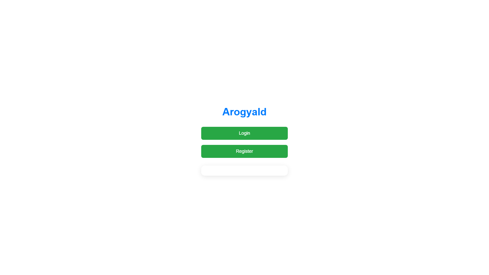
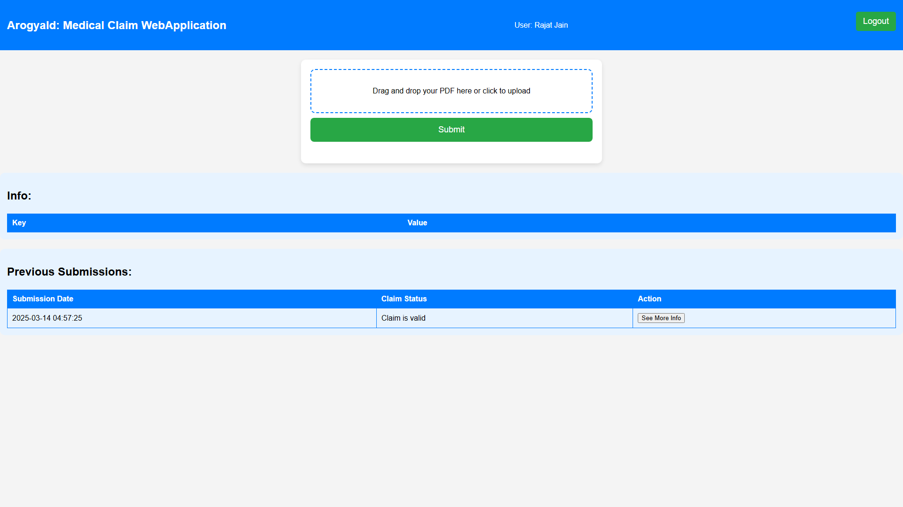
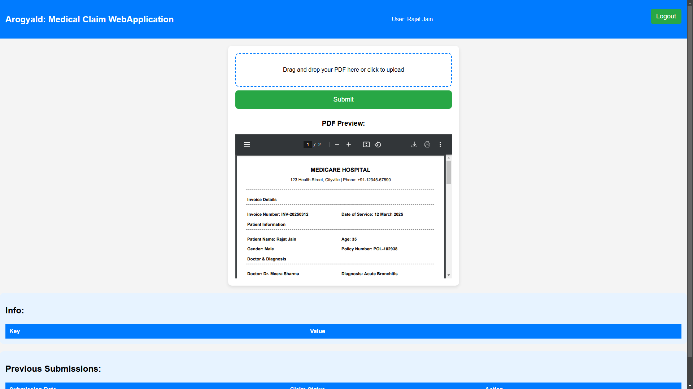
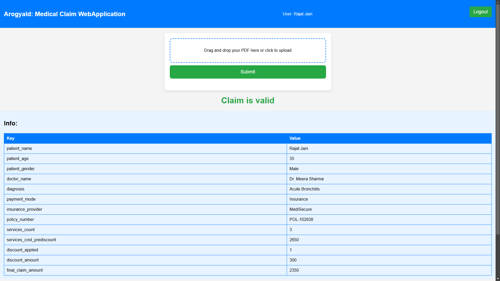

# ArogyaId - Medical Claim Web Application

## Overview
ArogyaId is a web application designed to facilitate the submission and processing of medical claims. Users can upload PDF documents containing their medical claims, and the application extracts relevant information using Optical Character Recognition (OCR) with Tesseract. The extracted data is then used to predict the validity of the claim.

## Screenshots
Here are some screenshots of the application:

### Login Page
  

### Home Page
  

### PDF Upload
 

### Prediction Result



# Start of Selection
[](https://colab.research.google.com/drive/1fQfSwMdc9Y91rhiTwEPupJRmwMUW4i2m?usp=sharing)


## Features
- User registration and login functionality.
- PDF upload for medical claims.
- Extraction of patient information from scanned PDFs.
- Prediction of claim validity using a machine learning model.
- Display of previous submissions and their statuses.

## Technologies Used
- **Flask**: A lightweight WSGI web application framework for Python.
- **MongoDB**: A NoSQL database for storing user and claim information.
- **Tesseract OCR**: An open-source OCR engine for extracting text from images and PDFs.
- **Pandas**: A data manipulation library for handling data in Python.
- **Joblib**: A library for saving and loading Python objects, used for model serialization.
- **PDF2Image**: A library for converting PDF files to images for OCR processing.

## Machine Learning Model
The application uses a machine learning model to predict the validity of medical claims. The model was trained on a generated dataset that simulates various medical claim scenarios. This dataset includes features such as:
- Patient age
- Patient gender
- Diagnosis
- Payment mode
- Services count
- Service costs (pre-discount)
- Discounts applied
- Final claim amount

The model was trained using the following steps:
1. **Data Generation**: A synthetic dataset was created to represent various medical claims, ensuring a diverse range of scenarios for training.
2. **Feature Engineering**: Relevant features were extracted and transformed to prepare the data for modeling.
3. **Model Training**: The model was trained using a supervised learning approach, utilizing algorithms suitable for classification tasks.
4. **Model Evaluation**: The model's performance was evaluated using metrics such as accuracy, precision, and recall to ensure its effectiveness in predicting claim validity.

## Installation

### Prerequisites
- Python 3.x
- MongoDB installed and running
- Tesseract OCR installed on your system

### Setup
1. Clone the repository:
   ```bash
   git clone https://github.com/RajatJain2003visual/MedicalInsuranceClaim.git
   cd arogyaid
   ```

2. Install the required Python packages:
   ```bash
   pip install -r requirements.txt
   ```

3. Set up your MongoDB database:
   - Ensure MongoDB is running on your local machine or update the connection URI in `app.py` to point to your MongoDB instance.

4. Install Tesseract OCR:
   - Follow the installation instructions for your operating system from the [Tesseract OCR documentation](https://tesseract-ocr.github.io/tessdoc/Installation.html).

5. Update the Tesseract command path in `app.py`:
   ```python
   pt.pytesseract.tesseract_cmd = r'Tesseract-OCR\tesseract.exe'  # Update this path as necessary
   ```

## Usage
1. Start the Flask application:
   ```bash
   python app.py
   ```

2. Open your web browser and navigate to `http://127.0.0.1:5000/`.

3. Register a new account or log in with an existing account.

4. Upload your medical claim PDF and view the extracted information and prediction results.

## Contributing
Contributions are welcome! Please feel free to submit a pull request or open an issue for any bugs or feature requests.

## License
This project is licensed under the MIT License - see the [LICENSE](LICENSE) file for details.

## Acknowledgments
- [Flask](https://flask.palletsprojects.com/) for the web framework.
- [MongoDB](https://www.mongodb.com/) for the database.
- [Tesseract OCR](https://github.com/tesseract-ocr/tesseract) for the OCR engine.
- [Pandas](https://pandas.pydata.org/) for data manipulation.
